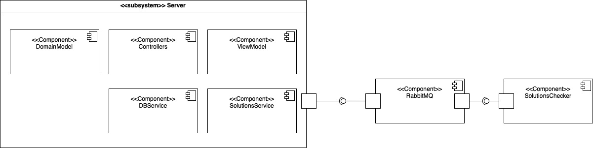

# Архитектура веб-сервиса MyHwProj

## Список разработчиков

- Абрамов Никита
- Венедиктов Роман
- Филиппов Денис

## Общие сведения о системе

### Назначение

Веб приложение для проверки домашних заданий студентов. 
Преподаватели могут загружать новые домашние задания и их системы проверки. 
Студенты могут сдавать свои решения в виде ссылки на GitHub.
Проверки запускаются автоматически и, после их завершения, все могут видеть их результаты (оценку и вывод)

### Границы системы

- Сервис поддерживает только одного студента и одного преподавателя
- Проверка выполняется полностью автоматически (программу для проверки пишет преподаватель)
- UI в виде web интерфейса из статичных html страниц

### Контекст системы

Веб приложение, поддерживаемое большинством популярных браузеров. 
Запускается под большинством популярных ОС. 
Также предоставляет REST API.

## Architectural drivers

### Технические ограничения

- Проверка запускается как отдельный процесс, ожидающий задач по очереди сообщений, нагрузка между ними должна балансироваться
- Для выбранного языка программирования нужны также библиотеки для сетевого взаимодействия, редактирования html и общения с базой данных

### Бизнес ограничения

- Сдача проекта за неделю
- В команде 3 разработчика

### Качественные характеристики системы

- Расширяемость
- Тестируемость
- Приемлемая производительность

### Функциональные требования
#### Студент может:

- Просматривать список домашних работ, отсортированный по близости дедлайна, причём
  должны показываться только работы, дата публикации которых уже наступила
- Сдать решение в виде ссылки на GitHub — для этого ему надо кликнуть на элемент
  списка домашних работ, в результате чего он попадёт на экран с детальной информацией
  о работе (включая полное условие), полем для ввода ссылки на решение и кнопкой «Submit»
- Просмотреть список результатов, отсортированный по дате сдачи
- Просмотреть детальную информацию о попытке по клику на элемент списка результатов, включая текстовый вывод программы-проверялки

#### Препод может:

- Добавить новую домашнюю работу
- Просмотреть список результатов, отсортированный по дате сдачи
- Просмотреть детальную информацию о попытке по клику на элемент списка результатов, включая текстовый вывод программы-проверялки

## Роли и случаи использования
Роли:
- преподаватель
- студент

Случаи использования:
- преподаватель хочет публиковать домашние задания, получать решения студента,
проверять их автоматически и смотреть результаты.
- студент хочет получать домашние задания, отправлять решения и видеть результаты
проверок.

## Диаграмма компонент

Состоит из подсистемы `Server` внутри которых находится модель (`DomainModel` и `ViewModel`), контроллеры, сервер для баз данных и сервис, который общается через `RabbitMQ` с `SolutionChecker`, который внутри тестирует задачу
## Диаграмма классов

- `HttpServer` -- главный класс, в котором происходит запуск приложения, происходит обработка действий пользователя
- `Controller` -- интерфейс для контроллеров, который будут обрабатывать действия пользователя.
   - `applyConfiguration(ServerContext)` -- метод для регистрации обработчиков по url
- `StudentRestController` и `StudentViewController` -- контроллеры для обработки действий студентов. Первый нужен для обработки rest-запросов, второй нужен для отрисовки. 
Во втором случае после выполнения метода возвращается HTML-файл, в первом же ORM сущности. 
Методы могут отображать страницу с одним дз (`getHomeworkPage`), список дз (`getHomeworksPage`), список решений (`getSubmissionPage`)
Так же есть метод для добавления нового решения (`postSubmission`)
- `TeacherRestController` и `TeacherViewController` -- аналогичные контроллеры для учителей, теперь есть метод для добавления дз (`postHomework`) и добавления решения к конкретному дз (`postChecker`)
- `StudentViewService` и `TeacherViewService` -- часть модели, которые общаются с соответствующими контроллерами и переадресуют свои запросы более общим Service
- `StudentService` и `TeacherService` -- часть модели, обрабатывают все запросы от пользователей. Общаются с сервисом базы данных: достать из нее что-то, положить новое добавленное дз и так далее.
`StudentService` так же выполняет метод `submit`, который помимо сохранения нового решения в базу данных передает это решение в `CheckerService` для автоматической проверки.
- `CheckerService` в методе `check` достает из базы данных саму задачу и чекеры к ней, после чего добавляет в очередь эту задачу вместе с чекером, условием и решением. 
- `DbService` общается с базой данных, добавляет/достает объекты
- `RabbitMQConsumer` -- `consumer` в терминах `RabbitMQ`. Он запускает внутри себя обработчики конкретной очереди. 
- `Runner` -- сам обработчик, принимает все необходимое и проверяет решение, возвращает результат. 
Таким образом, чтобы добавить свой чекер учителю надо выбрать задачу и передавать в виде текста bash скрипт, через методы `postSubmission` он сохранится в базе данных, а дальше все 
чекеры к конкретной задаче будут внутри `Runner` превращены в исполняемый код и запущены на решении
## ER-диаграмма 
Перейдем теперь к диаграмме, которая описывает сущности `Homework`, `Submission` и т д из предыдущего пункта

Тут описаны сущности и связи, которые хранятся в базе данных. 
Как видно, чекер -- это просто строчка bash скрипта. 
А также, что у одной домашки может быть сразу несколько чекеров. 